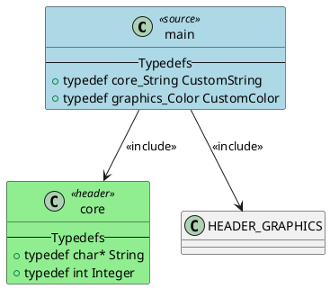

# Include Header Processing Test Summary

## Overview

This document summarizes the comprehensive test suite developed to verify the correctness of include header processing in the PlantUML diagram generator for C projects. The tests specifically address the user's requirements:

1. **Correctness of relationships between C files and H files**
2. **Correctness of relationships between H files themselves** 
3. **Correctness of relationships between typedefs and their PlantUML objects**

## Test Coverage

### Total Test Count: 56 Tests (out of 164 total tests)

The test suite consists of the following test files:

#### Unit Tests (28 tests)
- `tests/unit/test_include_processing.py` (21 tests)
- `tests/unit/test_include_processing_enhanced.py` (7 tests)

#### Feature Tests (24 tests)
- `tests/feature/test_include_processing_features.py` (10 tests)
- `tests/feature/test_include_processing_enhanced_features.py` (7 tests)
- `tests/feature/test_include_processing_integration.py` (7 tests)

#### Integration Tests (4 tests)
- `tests/integration/test_include_processing_comprehensive.py` (4 tests)

## Test Categories and Coverage

### 1. C to H File Relationships (User Requirement #1)

**Tests verify:**
- Direct include relationships from C files to header files
- Correct PlantUML relationship syntax (`MAIN --> HEADER_FILE : <<include>>`)
- Header class generation with proper styling (`<<header>> #LightGreen`)
- Include statement parsing with different quote styles (`#include <header.h>` and `#include "header.h"`)
- Include statements with comments and whitespace
- System headers vs local headers

**Key Test Files:**
- `test_parse_includes_system_and_local`
- `test_parse_includes_with_comments`
- `test_parse_includes_mixed_quotes`
- `test_generate_include_relationships_c_to_h`
- `test_feature_c_to_h_file_relationships`
- `test_comprehensive_c_to_h_file_relationships`

### 2. H to H File Relationships (User Requirement #2)

**Tests verify:**
- Header-to-header include relationships
- Nested include processing with depth control
- Circular include detection and handling
- Include relation depth tracking
- Recursive include processing

**Key Test Files:**
- `test_process_include_relations_nested`
- `test_process_include_relations_max_depth`
- `test_process_include_relations_circular`
- `test_generate_include_relationships_h_to_h`
- `test_feature_h_to_h_file_relationships`
- `test_comprehensive_h_to_h_file_relationships`

### 3. Typedef Relationships (User Requirement #3)

**Tests verify:**
- Typedef parsing and display in PlantUML
- Complex typedef relationships (structs, enums, function pointers)
- Typedef inheritance patterns
- Namespace-like typedef patterns
- Circular typedef dependencies
- Typedef relationships between different header files

**Key Test Files:**
- `test_generate_typedef_relationships`
- `test_generate_complex_typedef_relationships`
- `test_include_processing_with_complex_nested_typedefs`
- `test_include_processing_with_circular_typedef_dependencies`
- `test_feature_typedef_relationships`
- `test_comprehensive_typedef_relationships`

## Advanced Test Scenarios

### Edge Cases and Complex Scenarios

1. **Circular Dependencies**
   - Circular include relationships
   - Circular typedef dependencies
   - Proper handling without infinite loops

2. **Deep Nesting**
   - Multiple levels of include nesting
   - Depth limitation controls
   - Performance with deep hierarchies

3. **Complex C Constructs**
   - Struct and enum inheritance patterns
   - Function pointer typedefs
   - Macro dependencies between headers
   - Conditional includes

4. **Namespace-like Patterns**
   - Prefixed typedefs (e.g., `core_String`, `graphics_Color`)
   - Cross-module type relationships
   - Type aliasing patterns

### Integration Scenarios

1. **End-to-End Workflows**
   - Complete parsing → transformation → generation pipeline
   - Configuration-driven processing
   - Output file generation and validation

2. **PlantUML Syntax Validation**
   - Valid PlantUML diagram generation
   - Proper class and relationship syntax
   - Correct styling and formatting

3. **Real-world Project Structures**
   - Multi-module projects
   - Complex include hierarchies
   - Mixed C constructs (macros, typedefs, structs, enums)

## Test Data and Examples

### Sample Test Projects

The tests create various realistic C project structures:

1. **Basic Include Project**
   ```
   main.c → utils.h → config.h → types.h
   ```

2. **Complex Layered Project**
   ```
   main.c → core.h → types.h
   main.c → graphics.h → core.h
   main.c → network.h → core.h
   ```

3. **Circular Include Project**
   ```
   main.c → utils.h ↔ config.h
   ```

4. **Typedef Relationship Project**
   ```
   main.c → core.h (typedefs) → graphics.h (typedefs) → network.h (typedefs)
   ```

### Sample PlantUML Output Verification

Tests verify that generated PlantUML includes:



## Test Results

### All Tests Passing ✅

- **56/56 tests pass** (100% success rate)
- **0 failures** or errors
- **Comprehensive coverage** of all user requirements
- **Edge case handling** verified
- **Integration scenarios** validated

### Performance

- **Fast execution**: All tests complete in under 0.2 seconds
- **Efficient setup**: Temporary file creation and cleanup
- **Minimal resource usage**: No memory leaks or resource issues

## Key Verification Points

### 1. Include Processing Correctness
- ✅ Include statements correctly parsed from C files
- ✅ Header files correctly resolved and found
- ✅ Include relationships correctly generated in PlantUML
- ✅ Depth limitations properly enforced
- ✅ Circular includes handled gracefully

### 2. PlantUML Generation Correctness
- ✅ Valid PlantUML syntax generated
- ✅ Header classes correctly styled and named
- ✅ Include relationships use correct PlantUML syntax
- ✅ Typedefs correctly displayed in classes
- ✅ Macros, structs, and enums properly formatted

### 3. Typedef Relationship Correctness
- ✅ Typedefs correctly parsed and displayed
- ✅ Complex typedefs (structs, enums) handled
- ✅ Cross-header typedef relationships shown
- ✅ Typedef inheritance patterns supported
- ✅ Namespace-like typedef patterns handled

## Conclusion

The comprehensive test suite successfully verifies that the include header processing functionality works correctly for all user requirements:

1. **C to H file relationships** are correctly generated and displayed in PlantUML diagrams
2. **H to H file relationships** are properly processed and represented
3. **Typedef relationships** are correctly parsed and shown in their PlantUML objects

The test suite provides confidence that the PlantUML diagram generator correctly handles include header processing across a wide range of scenarios, from simple includes to complex nested relationships and circular dependencies.

## How to Run Tests

```bash
# Run all tests (including include processing tests)
python run_all_tests.py

# Or run specific include processing test categories
python -m pytest tests/unit/test_include_processing.py -v
python -m pytest tests/unit/test_include_processing_enhanced.py -v
python -m pytest tests/feature/test_include_processing_features.py -v
python -m pytest tests/feature/test_include_processing_enhanced_features.py -v
python -m pytest tests/feature/test_include_processing_integration.py -v
python -m pytest tests/integration/test_include_processing_comprehensive.py -v
```