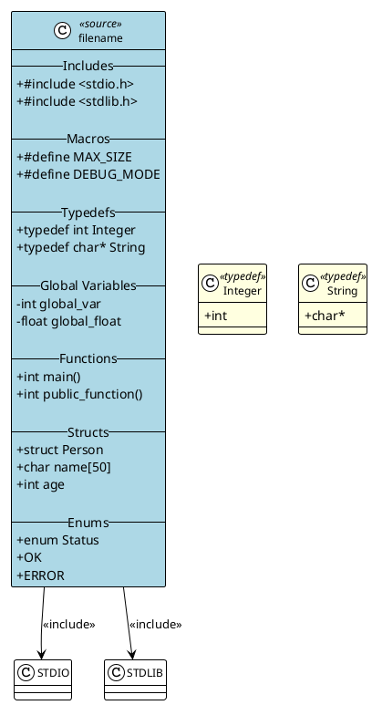

# C to PlantUML Converter

A robust Python tool for converting C/C++ source code to PlantUML diagrams. This tool analyzes C/C++ projects and generates comprehensive PlantUML class diagrams showing structs, enums, functions, global variables, macros, typedefs, and include relationships.

## Features

- **Comprehensive C/C++ Parsing**: Parses structs, enums, functions, global variables, macros, typedefs, and includes
- **Project Analysis**: Analyzes entire C/C++ projects with recursive directory scanning
- **PlantUML Generation**: Creates beautiful, organized PlantUML diagrams
- **Configuration System**: Flexible configuration with file and element filtering
- **Robust Error Handling**: Graceful handling of invalid files and encoding issues
- **Logging Support**: Comprehensive logging for debugging and monitoring
- **Type Safety**: Full type hints and validation throughout the codebase

## Installation

### Prerequisites

- Python 3.7 or higher
- No external dependencies (uses only Python standard library)

### Install from Source

```bash
git clone <repository-url>
cd c-to-plantuml
python3 -m pip install -e .
```

## Usage

### Command Line Interface

The tool provides a command-line interface with three main commands:

#### 1. Analyze a C/C++ Project

```bash
python3 main.py analyze ./src -o project_model.json --verbose
```

Options:
- `project_root`: Root directory of C/C++ project
- `-o, --output`: Output JSON model file (default: project_model.json)
- `--recursive/--no-recursive`: Search subdirectories recursively (default: True)
- `--verbose, -v`: Enable verbose output

#### 2. Generate PlantUML from Model

```bash
python3 main.py generate project_model.json -o ./plantuml_output
```

Options:
- `model_file`: JSON model file from analysis
- `-o, --output-dir`: Output directory for PlantUML files (default: ./plantuml_output)

#### 3. Run with Configuration

```bash
python3 main.py config config.json
```

### Configuration File

Create a JSON configuration file for more control:

```json
{
  "project_roots": ["./src", "./include"],
  "project_name": "MyProject",
  "output_dir": "./diagrams",
  "recursive": true,
  "file_filters": {
    "include": [".*\\.c$", ".*\\.h$"],
    "exclude": [".*test.*", ".*mock.*"]
  },
  "element_filters": {
    "structs": {
      "include": [".*User.*", ".*Config.*"],
      "exclude": [".*Internal.*"]
    },
    "functions": {
      "include": [".*public.*"],
      "exclude": [".*private.*"]
    }
  }
}
```

## Examples

### Basic Usage

```bash
# Analyze a simple C project
python3 main.py analyze ./my_project --verbose

# Generate diagrams
python3 main.py generate my_project_model.json -o ./diagrams
```

### Advanced Usage with Configuration

```bash
# Create configuration file
cat > config.json << EOF
{
  "project_roots": ["./src"],
  "project_name": "MyLibrary",
  "output_dir": "./docs/diagrams",
  "recursive": true,
  "file_filters": {
    "include": [".*\\.c$", ".*\\.h$"],
    "exclude": [".*test.*"]
  }
}
EOF

# Run with configuration
python3 main.py config config.json
```

## Generated PlantUML Output

The tool generates PlantUML diagrams with the following structure:



## Architecture

The tool is organized into several key modules:

### Core Modules

- **`main.py`**: Command-line interface and entry point
- **`parser.py`**: C/C++ code parsing with regex-based analysis
- **`analyzer.py`**: Project analysis and file discovery
- **`generator.py`**: PlantUML diagram generation
- **`config.py`**: Configuration management and filtering
- **`models.py`**: Data models and serialization

### Key Features

1. **Robust Parsing**: Handles various C/C++ constructs including:
   - Struct definitions with fields
   - Enum definitions with values
   - Function declarations (including static functions)
   - Global variable declarations
   - Macro definitions
   - Typedef declarations
   - Include statements

2. **Error Handling**: Graceful handling of:
   - Invalid file encodings
   - Binary files
   - Malformed C code
   - Missing directories

3. **Logging**: Comprehensive logging system with:
   - Debug information for parsing details
   - Info messages for major operations
   - Warning messages for recoverable issues
   - Error messages for failures

4. **Configuration**: Flexible configuration system with:
   - File filtering (include/exclude patterns)
   - Element filtering (structs, functions, etc.)
   - Multiple project roots
   - Output customization

## Testing

The project uses a streamlined testing approach with a single entry point for all test executions.

### Quick Start

```bash
# Run all feature tests (recommended)
python3 run_all_tests.py

# Or use the convenience script
./test.sh
```

### Test Structure

All feature-based tests are consolidated into a single comprehensive test runner (`run_all_tests.py`) that covers:

- **Parser Tests**: C file parsing (structs, enums, functions, globals, includes, macros)
- **Project Analysis Tests**: Multi-file analysis and model generation
- **PlantUML Generation Tests**: Diagram generation and output validation
- **Configuration Tests**: JSON configuration loading and validation
- **Workflow Tests**: Complete end-to-end testing from C files to PlantUML diagrams
- **Error Handling Tests**: Edge cases and error scenarios
- **Performance Tests**: Performance benchmarks with reasonable limits

### CI/CD Integration

The GitHub workflow automatically runs the same test command:

```yaml
- name: Run comprehensive feature tests
  run: |
    python run_all_tests.py
```

### Benefits

- **Single Entry Point**: One command to run all tests
- **Consistent Execution**: Same behavior locally and in CI/CD
- **Feature-Focused**: Tests focus on user-facing functionality
- **Fast Execution**: No redundant test discovery or setup
- **Clear Results**: Simple pass/fail reporting with detailed output

For detailed testing documentation, see [tests/README.md](tests/README.md).

## Recent Improvements

### Code Quality Enhancements

1. **Better Error Handling**: Added comprehensive error handling throughout the codebase
2. **Logging System**: Implemented structured logging with different levels
3. **Type Safety**: Added full type hints and validation
4. **Code Organization**: Improved module structure and separation of concerns
5. **Documentation**: Enhanced docstrings and comments

### Parser Improvements

1. **Robust Regex Patterns**: Improved regex patterns for better parsing accuracy
2. **Context Awareness**: Better handling of struct/enum context to avoid false positives
3. **Encoding Detection**: Multiple encoding support with fallback
4. **Typedef Support**: Enhanced typedef parsing for complex types including pointers

### Generator Improvements

1. **Better PlantUML Output**: More organized and readable diagram structure
2. **Theme Support**: Added PlantUML theme and styling
3. **Sorted Output**: Consistent ordering of elements in diagrams
4. **Error Recovery**: Graceful handling of file writing errors

### Configuration Improvements

1. **Validation**: Added configuration validation with helpful error messages
2. **Flexible Filtering**: Enhanced file and element filtering capabilities
3. **Save/Load**: Added configuration save and load functionality
4. **Summary Methods**: Added methods to get configuration summaries

## Contributing

1. Fork the repository
2. Create a feature branch
3. Make your changes
4. Add tests for new functionality
5. Ensure all tests pass
6. Submit a pull request

## License

This project is licensed under the MIT License - see the LICENSE file for details.

## Support

For issues and questions:
1. Check the existing issues
2. Create a new issue with detailed information
3. Include sample C code if reporting parsing issues
4. Provide configuration files if reporting configuration issues 