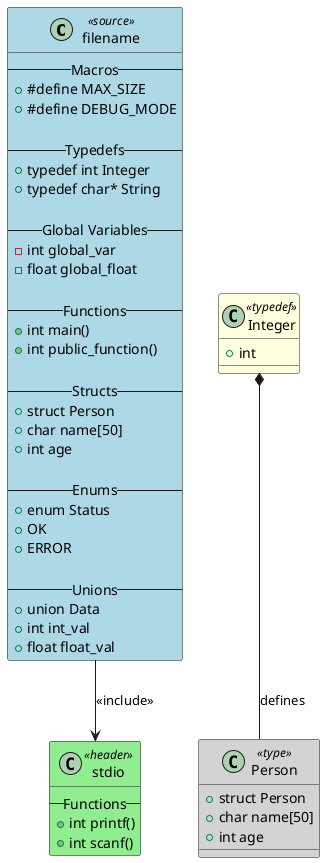

# C to PlantUML Converter

A robust Python tool for converting C/C++ source code to PlantUML diagrams. This tool analyzes C/C++ projects and generates comprehensive PlantUML class diagrams showing structs, enums, unions, functions, global variables, macros, typedefs, and include relationships.

## Features

- **Comprehensive C/C++ Parsing**: Parses structs, enums, unions, functions, global variables, macros, typedefs, and includes
- **Project Analysis**: Analyzes entire C/C++ projects with recursive directory scanning
- **PlantUML Generation**: Creates beautiful, organized PlantUML diagrams with proper UML notation
- **Configuration System**: Flexible configuration with file and element filtering
- **Model Transformation**: Advanced model transformation with renaming, addition, and removal capabilities
- **Typedef Relationship Analysis**: Comprehensive parsing of typedef relationships with proper UML stereotypes
- **Union Support**: Full parsing and visualization of union definitions with fields
- **Robust Error Handling**: Graceful handling of invalid files and encoding issues
- **Cross-Platform Encoding Support**: Automatic detection and handling of different file encodings (UTF-8, Windows-1252, Windows-1254, etc.)
- **Logging Support**: Comprehensive logging for debugging and monitoring
- **Type Safety**: Full type hints and validation throughout the codebase
- **Modular Architecture**: 3-step processing pipeline for maximum flexibility

## Installation

### Prerequisites

- Python 3.7 or higher
- No external dependencies (uses only Python standard library)

### Install from Source

```bash
git clone <repository-url>
cd generator_project
python3 -m pip install -e .
```

### Development Setup

For development, install additional dependencies:

```bash
pip install -r requirements-dev.txt
```

## GitHub Actions Setup

This project includes GitHub Actions workflows for automated PlantUML to JPEG conversion. To set up the workflows properly, you need to configure authentication.

### Authentication Setup

The workflow requires write permissions to commit generated images back to the repository. You have two options:

#### Option 1: Use Personal Access Token (Recommended)

1. Create a Personal Access Token (PAT) with `repo` scope:
   - Go to GitHub Settings → Developer settings → Personal access tokens → Tokens (classic)
   - Generate a new token with `repo` permissions
   - Copy the token

2. Add the token as a repository secret:
   - Go to your repository Settings → Secrets and variables → Actions
   - Create a new secret named `PERSONAL_ACCESS_TOKEN`
   - Paste your PAT as the value

#### Option 2: Use Workflow Permissions (Alternative)

The workflow is configured with explicit permissions that should work for most repositories. If you're still getting permission errors, ensure your repository settings allow workflow write access:

1. Go to repository Settings → Actions → General
2. Under "Workflow permissions", select "Read and write permissions"
3. Check "Allow GitHub Actions to create and approve pull requests"

### Running the Workflow

1. Go to the Actions tab in your repository
2. Select "Convert PlantUML to JPEG" workflow
3. Click "Run workflow"
4. Configure the input parameters:
   - **Output folder**: Directory containing .puml files (default: `output`)
   - **Commit changes**: Whether to commit generated images (default: `true`)

## Usage

The tool provides a 3-step processing pipeline that can be executed individually or chained together:

### Processing Flow

1. **Parse** - Parses C code files and generates model.json
2. **Transform** - Modifies the model file based on transformation configuration
3. **Generate** - Generates puml files based on the model.json

### Command Line Interface

The tool provides a 3-step processing pipeline that can be executed individually or chained together:

#### 1. Parse C/C++ Project (Step 1)

```bash
python3 main.py parse ./src -o model.json --verbose
```

Options:
- `project_root`: Root directory of C/C++ project
- `-o, --output`: Output JSON model file (default: model.json)
- `--recursive/--no-recursive`: Search subdirectories recursively (default: True)
- `--verbose, -v`: Enable verbose output

#### 2. Transform Model (Step 2)

```bash
python3 main.py transform model.json config.json -o transformed_model.json
```

Options:
- `model_file`: Input JSON model file
- `config_file`: Configuration JSON file
- `-o, --output`: Output transformed model file (default: overwrites input)

#### 3. Generate PlantUML (Step 3)

```bash
python3 main.py generate model.json -o ./plantuml_output
```

Options:
- `model_file`: JSON model file
- `-o, --output-dir`: Output directory for PlantUML files (default: ./plantuml_output)

#### 4. Complete Workflow (All Steps)

```bash
python3 main.py workflow ./src config.json
```

Options:
- `project_root`: Root directory of C/C++ project
- `config_file`: Configuration JSON file
- `--recursive/--no-recursive`: Search subdirectories recursively (default: True)

### Configuration File

Create a JSON configuration file for transformation and filtering:

```json
{
  "source_folders": ["./src", "./include"],
  "project_name": "MyProject",
  "output_dir": "./diagrams",
  "recursive": true,
  "include_depth": 2,
  "file_filters": {
    "include": [".*\\.c$", ".*\\.h$"],
    "exclude": [".*test.*", ".*mock.*"]
  },
  "element_filters": {
    "structs": {
      "include": [".*User.*", ".*Config.*"],
      "exclude": [".*Internal.*"]
    },
    "functions": {
      "include": [".*public.*"],
      "exclude": [".*private.*"]
    }
  },
  "transformations": {
    "file_selection": {
      "selected_files": [".*main\\.c$", ".*utils\\.c$"]
    },
    "rename": {
      "structs": {
        "old_name": "new_name"
      }
    },
    "add": {
      "structs": {
        "NewStruct": {
          "fields": [
            {"name": "field1", "type": "int"},
            {"name": "field2", "type": "char*"}
          ]
        }
      }
    }
  }
}
```

## Examples

### Basic Usage

```bash
# Step 1: Parse a C project
python3 main.py parse ./my_project --verbose

# Step 2: Transform the model (optional)
python3 main.py transform model.json config.json

# Step 3: Generate diagrams
python3 main.py generate model.json -o ./diagrams
```

### Advanced Usage with Complete Workflow

```bash
# Create configuration file
cat > config.json << EOF
{
  "source_folders": ["./src"],
  "project_name": "MyLibrary",
  "output_dir": "./docs/diagrams",
  "recursive": true,
  "include_depth": 2,
  "file_filters": {
    "include": [".*\\.c$", ".*\\.h$"],
    "exclude": [".*test.*"]
  }
}
EOF

# Run complete workflow
python3 main.py workflow ./src config.json
```

## Generated PlantUML Output

The tool generates PlantUML diagrams with the following structure:



### Key Features of Generated Diagrams

- **Typedef Relationships**: Proper UML stereotypes («defines», «alias») for typedef relationships
- **Union Support**: Full parsing and display of union definitions with fields
- **Include Depth Processing**: Configurable depth for processing include relationships
- **Header Content Display**: All referenced include files shown as classes with their actual content
- **Header-to-Header Relationships**: Include relationships between headers displayed with arrows
- **Color-Coded Stereotypes**: Different colors for source files, headers, typedefs, and types

## Architecture

The tool is organized into a modular 3-step architecture:

### Core Modules

- **`main.py`**: Command-line interface and entry point
- **`parser.py`**: Step 1 - Parse C/C++ files and generate model.json
- **`transformer.py`**: Step 2 - Transform model based on configuration
- **`generator.py`**: Step 3 - Generate puml files based on model.json
- **`models.py`**: Data models and serialization
- **`config.py`**: Configuration management and filtering

### Key Features

1. **Robust Parsing**: Handles various C/C++ constructs including:
   - Struct definitions with fields
   - Enum definitions with values
   - Union definitions with fields
   - Function declarations
   - Global variable declarations
   - Macro definitions
   - Typedef relationships with proper UML stereotypes
   - Include relationships

2. **Advanced Filtering**: 
   - File-level filtering with regex patterns
   - Element-level filtering for structs, enums, unions, functions, etc.
   - Include depth configuration
   - File selection for transformer actions

3. **Model Transformation**:
   - Element renaming
   - Element addition
   - Element removal
   - Configuration-driven transformations
   - File selection for applying transformations

4. **PlantUML Generation**:
   - Proper UML notation
   - Typedef relationship visualization with stereotypes («defines», «alias»)
   - Header content display
   - Include relationship arrows
   - Color-coded stereotypes
   - Union field display

5. **Cross-Platform Encoding Support**:
   - Automatic detection of file encodings (UTF-8, Windows-1252, Windows-1254, etc.)
   - Platform-aware encoding fallbacks
   - BOM (Byte Order Mark) detection for UTF-8 and UTF-16 files
   - Graceful handling of encoding detection failures
   - Consistent behavior across Windows, Linux, and macOS

## Development

### Project Structure

```
c_to_plantuml/
├── main.py                 # CLI entry point
├── parser.py               # Step 1: Parse C/C++ files
├── transformer.py          # Step 2: Transform model
├── generator.py            # Step 3: Generate PlantUML
├── models.py               # Data models
├── config.py               # Configuration management
└── __init__.py             # Package initialization

tests/
├── unit/                   # Unit tests
│   ├── test_parser.py      # Parser tests
│   ├── test_transformer.py # Transformer tests
│   ├── test_generator.py   # Generator tests
│   ├── test_config.py      # Configuration tests
│   └── test_parser_filtering.py # User configurable filtering tests
├── feature/                # Feature tests
│   ├── test_integration.py # Integration tests
│   ├── test_parser_features.py # Parser feature tests
│   ├── test_generator_features.py # Generator feature tests
│   ├── test_transformer_features.py # Transformer feature tests
│   └── test_project_analysis_features.py # Project analysis tests
└── test_files/             # Test input files
```

### Running Tests

```bash
# Run all tests (recommended)
python run_all_tests.py

# Run with shell script
./test.sh

# Run specific test categories
python -m unittest tests.unit.test_parser
python -m unittest tests.unit.test_generator
python -m unittest tests.feature.test_integration
```

## GitHub Workflows

### Convert PlantUML to JPEG

This repository includes a GitHub workflow that automatically converts PlantUML (`.puml`) files to JPEG images. The workflow uses the `picgen.sh` script and can be triggered manually.

#### How to Use

1. **Manual Trigger**: Go to the "Actions" tab in your GitHub repository
2. **Select Workflow**: Choose "Convert PlantUML to JPEG" from the workflows list
3. **Run Workflow**: Click "Run workflow" and configure:
   - **Output folder**: Specify custom folder (defaults to `output`)
   - **Commit changes**: Enable/disable automatic commit of generated images (default: enabled)
4. **Results**: 
   - Generated JPEG images are automatically committed to the repository
   - Images are also available as downloadable artifacts

#### What the Workflow Does

- Installs PlantUML and ImageMagick on a Ubuntu runner
- Scans the specified folder for `.puml` files
- Converts each PlantUML file to JPEG format
- **Automatically commits generated images to the repository** (configurable)
- Uploads the generated images as downloadable artifacts
- Provides detailed logs of the conversion process
- Creates informative commit messages with file details

#### Prerequisites

The workflow automatically installs:
- PlantUML (for diagram generation)
- ImageMagick (for PNG to JPEG conversion)
- Java Runtime Environment (required by PlantUML)

#### Commit Behavior

- **Default**: Generated images are automatically committed to the repository
- **Configurable**: You can disable automatic commits via the workflow input
- **Branch**: Images are committed to the same branch that triggered the workflow
- **Commit Message**: Includes details about which `.puml` files were converted and which images were generated
- **Permissions**: Uses `GITHUB_TOKEN` for authentication (no additional setup required)

#### Local Usage

You can also run the conversion locally:

```bash
# Make the script executable (if not already)
chmod +x picgen.sh

# Run the conversion
./picgen.sh
```

The script will:
- Convert all `.puml` files in the `output` directory to JPEG
- Create both PNG (intermediate) and JPEG (final) files
- Provide detailed progress information

## Troubleshooting

### GitHub Actions Permission Errors

If you encounter permission errors like `Permission to fischerjooo/generator_project.git denied to github-actions[bot]`, follow these steps:

1. **Check Repository Settings**:
   - Go to repository Settings → Actions → General
   - Ensure "Workflow permissions" is set to "Read and write permissions"
   - Check "Allow GitHub Actions to create and approve pull requests"

2. **Set up Personal Access Token** (if repository settings don't work):
   - Create a PAT with `repo` scope
   - Add it as a repository secret named `PERSONAL_ACCESS_TOKEN`
   - The workflow will automatically use it for authentication

3. **Verify Secret Configuration**:
   - Go to repository Settings → Secrets and variables → Actions
   - Ensure `PERSONAL_ACCESS_TOKEN` is properly configured

### Common Issues

- **No images generated**: Check that `.puml` files exist in the specified output folder
- **Conversion failures**: Ensure PlantUML syntax is valid in your `.puml` files
- **Authentication errors**: Follow the authentication setup steps above

## Contributing

1. Fork the repository
2. Create a feature branch
3. Make your changes following the 3-step architecture
4. Add tests for new functionality
5. Update documentation
6. Submit a pull request

## License

This project is licensed under the MIT License - see the LICENSE file for details. 